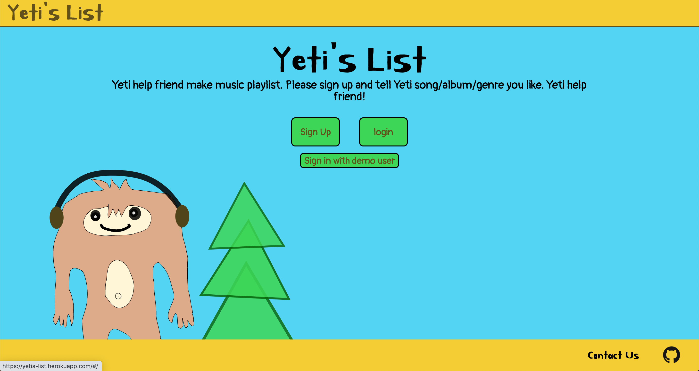
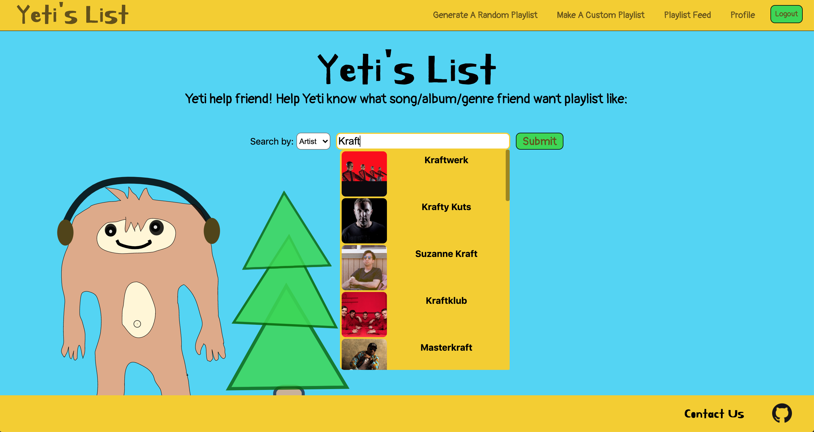
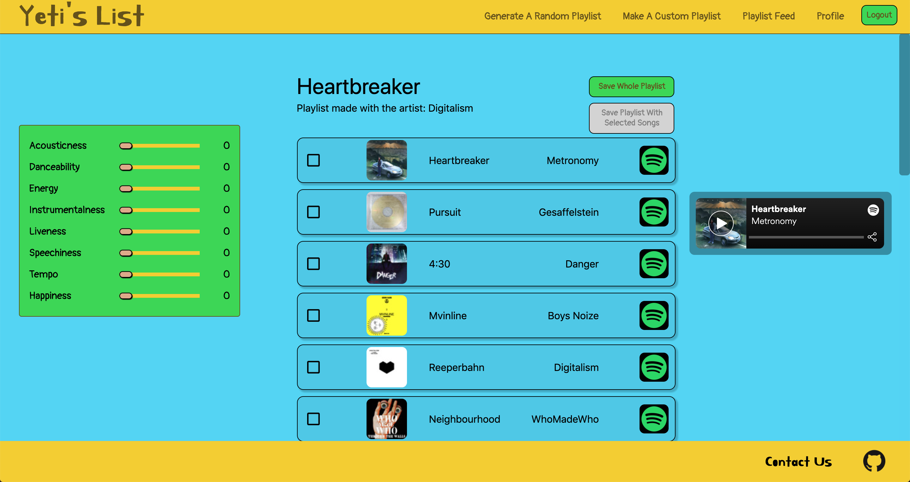
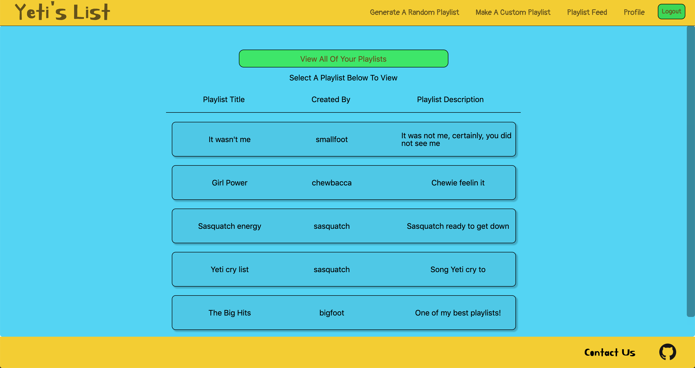

# Yeti's List
Yeti's list is an application for users to generate playlists based on songs, artists, or genres they search for. Users are also able to specify certain criteria for their playlists based on certain song metrics such as danceability, tempo, and popularity. Playlists are saved to each user's account so they can come back to them and are accessible to all who use the site!
***


[Yeti's List Live Site](https://yetis-list.herokuapp.com/#/)

## Table of Contents

* [Creators](#creators)
* [Screenshots](#screenshots)
* [Technologies](#technologies)
* [Feature Highlights](#feature-highlights)

### Creators

* [Elijah Ally](https://www.linkedin.com/in/elijah-ally-123ea/)
* [Brian Codington](https://www.linkedin.com/in/brian-codington-8322a8216/)
* [Kevin Oconnor](https://www.linkedin.com/in/kevin-oconnor-933561216/)
* [Kevin Yunas](https://www.linkedin.com/in/kevin-yunas-987325183/)

### Screenshots





### Technologies

* Frontend
  * [React](https://www.npmjs.com/package/react)
  * [Redux](https://www.npmjs.com/package/redux)
  * [redux-persist](https://www.npmjs.com/package/redux-persist)
  * [axios](https://www.npmjs.com/package/axios)
  * [Underscore](https://www.npmjs.com/package/underscore)

* Backend
  * [Node.js](https://nodejs.org/en/)
  * [Express](https://www.npmjs.com/package/express)
  * [MongoDB](https://www.mongodb.com)
  * [Mongoose](https://www.npmjs.com/package/mongoose)
  * [jsonwebtoken](https://www.npmjs.com/package/jsonwebtoken)
  * [Passport](https://www.npmjs.com/package/passport)
  * [Validator](https://www.npmjs.com/package/validator)
  * [bcryptjs](https://www.npmjs.com/package/bcryptjs)
  * [spotify-web-api-node](https://github.com/thelinmichael/spotify-web-api-node)

### Feature Highlights

* `makePlaylist` is called from the backend after receiving the searched item from the frontend
* the searched item is packaged before being passed in to conform to the inputs of the `getRecommendations` api function
* from the express route the `res` object is also passed in in order to set the content of the response once the newly created playlist is received from the Spotify API
* the use of promises ensures that data is only returned to the frontend once it is available from the Spotify API

```js
function makeplaylist(playlistQueryObject, res) {
  // Create the api object with the credentials
  var spotifyApi = new SpotifyWebApi({
    clientId: spotifyKeys.clientId,
    clientSecret: spotifyKeys.clientSecret,
  });

  // Retrieve an access token.
  spotifyApi.clientCredentialsGrant().then(function (data) {

    // Save the access token so that it's used in future calls
    spotifyApi.setAccessToken(data.body["access_token"]);

    spotifyApi.getRecommendations(playlistQueryObject).then(
      (data) => {
        let playlist = playlistUtils.playlistToJSON(data);
        playlist.items = playlist.items.reverse()

        res.json(playlist);
      },
      function (err) {
        console.log(err)
      }
    );
  }).catch(err => console.log(err))
};

```

* The callback function for the user signup route with a method of post that signs up a new user.
* Once a request is sent, `Validator` is used to check for any missing fields or incorrectly formmatted emails. 
* We then check to see if the email already exists in our database on `MongoDB`. If there are no duplicates a new user is created using the schema we built with `Mongoose`. 
* For protection against rainbow attacks the password is encrypted using `BCrypt` before the user is saved to MongoDB and on success is returned as JSON.

```js
router.post('/signup', (req, res) => {
   const { errors, isValid } = validateRegisterInput(req.body);
   if (!isValid) return res.status(400).json(errors)
   const {email, username, password} = req.body;

   User.findOne({email}).then((user) => {
      if (user) {
         return res
	   .status(400)
	   .json({ email: 'A user has already registered with this address' });
      } else {
	 const newUser = new User({
	    username,
	    email,
	    password,
	 });

	 bcrypt.genSalt(10, (err, salt) => {
	    bcrypt.hash(newUser.password, salt, (err, hash) => {
	       if (err) throw err;
	       newUser.password = hash;
	       newUser
	          .save()
		  .then(() => res.json(newUser))
		  .catch((err) => console.log(err));
	    });
	 });
      }
   }).catch((err) => console.log(err));
});
```
